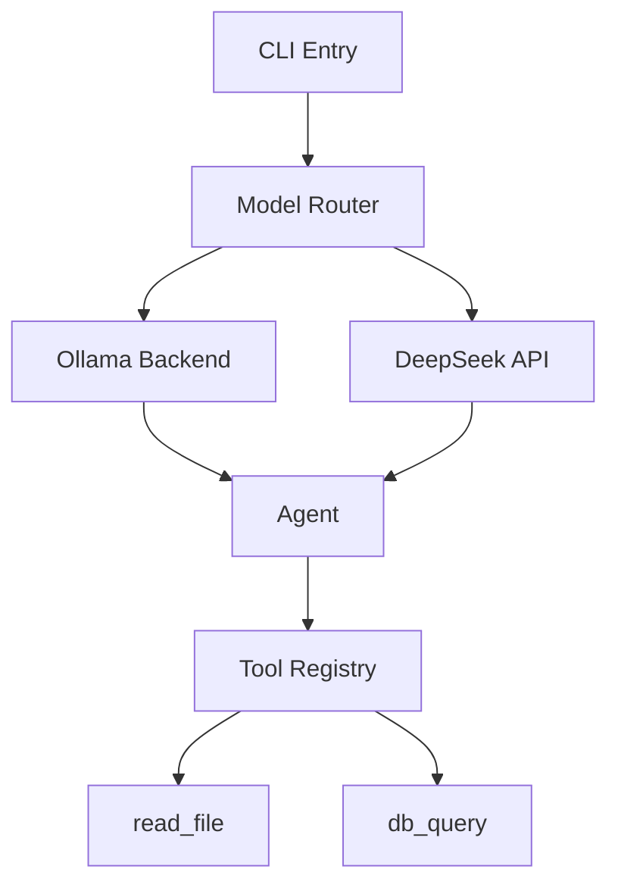

# Mermaid Architect — Codebase to Architecture Diagrams

Turn any codebase into clear, navigable architecture diagrams using Mermaid.js.

## Commands

- `/mermaid-architect` — Generate full architecture diagram of current project
- `/mermaid-architect <module>` — Focus on a specific module

## What it generates

1. **System Overview**: High-level component diagram
2. **Data Flow**: How data moves through the system
3. **Module Dependencies**: What depends on what
4. **API Surface**: Endpoints and their relationships

## How it works

1. Scan the codebase using Glob and Grep
2. Identify components, imports, dependencies
3. Generate Mermaid.js markdown diagram
4. Write to `docs/architecture.md`

## Output format

Write diagrams to `docs/diagrams/` directory. Use `%%` comments for notes.
